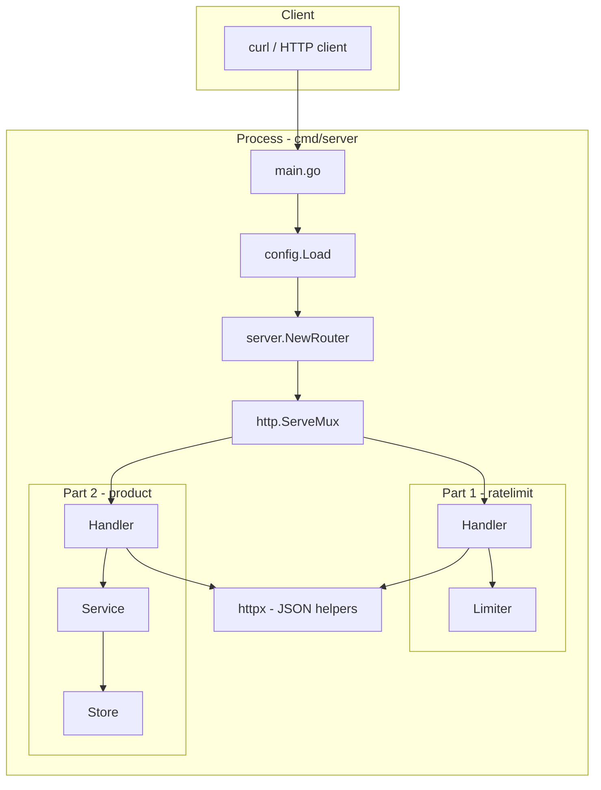

# Architecture

Single-process Go HTTP service for **Part 1** (per-user rate limiting) and **Part 2** (product catalog). Both features share one `http.Server`, one router, and in-memory state. There is no database, message bus, or external cache.

## System overview



| Concern | Location |
|---------|----------|
| Boot, graceful shutdown | `cmd/server/main.go` |
| Route table, path param wiring | `internal/server/router.go` |
| Environment config | `internal/config` |
| Shared JSON envelopes | `internal/httpx` |
| UUID generation / parsing | `internal/id` |

## Package layout

```
cmd/server/
  main.go                 Load config, start HTTP server, SIGINT/SIGTERM shutdown

internal/
  config/
    config.go             Env vars → Config struct (both parts)

  server/
    router.go             ServeMux routes; withProductID parses {id}

  httpx/
    response.go           WriteJSON, WriteError (standard error envelope)
    decode.go             DecodeJSON with 1 MiB body limit

  id/
    uuid.go               New(), Parse(), String()

  ratelimit/              Part 1 — handler + domain in one package
    types.go              Request/response DTOs
    limiter.go            Sliding-window limiter (in-memory)
    handler.go            POST /request, GET /stats

  product/                Part 2 — layered handler → service → store
    model.go              Product, ListItem, listPage
    errors.go             ErrNotFound, ErrDuplicateSKU
    validate.go           URL scheme, length, batch size
    store.go              In-memory maps, pagination, clones
    service.go            Validation, pagination rules, orchestration
    handler.go            HTTP adapters for /products/*
```

### Layering

| Package | Role |
|---------|------|
| **handler** | Parse HTTP (JSON, query params, path values), map errors → status codes |
| **service** (product only) | Business rules: required fields, URL validation, pagination bounds |
| **limiter / store** | Mutable in-memory state and concurrency |
| **model / types** | Domain and API shapes |

Part 1 keeps **handler + limiter** in `ratelimit` because the domain is small. Part 2 uses a full **handler → service → store** split.

## Boot sequence

1. `config.Load()` reads env vars (see [Configuration](#configuration)).
2. `server.NewRouter(cfg)` constructs:
   - `ratelimit.NewLimiter(max, window)` + `ratelimit.NewHandler`
   - `product.NewStore()` + `product.NewService(cfg, store)` + `product.NewHandler`
3. `http.Server` listens on `cfg.Addr` with `ReadHeaderTimeout: 5s`.
4. On `SIGINT` / `SIGTERM`, `Shutdown` runs with a 10s context timeout.

## HTTP surface

Registered in `internal/server/router.go` (Go 1.22+ method patterns):

| Method | Path | Handler | Success |
|--------|------|---------|---------|
| `POST` | `/request` | `ratelimit.Handler.PostRequest` | 200 |
| `GET` | `/stats` | `ratelimit.Handler.GetStats` | 200 |
| `POST` | `/products` | `product.Handler.Create` | 201 |
| `GET` | `/products` | `product.Handler.List` | 200 |
| `GET` | `/products/{id}` | `product.Handler.Get` | 200 |
| `POST` | `/products/{id}/media` | `product.Handler.AppendMedia` | 200 |

`withProductID` parses `r.PathValue("id")` via `id.Parse`. Invalid UUID → **400**. Valid UUID but missing product → **404** (from service/store).

## Request flows

### Part 1 — rate limit

```
POST /request
  → ratelimit.Handler.PostRequest
      read body (max 1 MiB), JSON decode
      validate user_id (non-blank), payload (present, valid JSON)
  → Limiter.TryAccept(userID)
      prune timestamps older than window
      if len(timestamps) >= max → reject (429)
      else append now, increment accepted
  → 200 AcceptedResponse | 429 + Retry-After

GET /stats
  → Limiter.Snapshot()
      copy user ids under map lock
      per user: lock, prune, read counters + window length
      sort by user_id
  → 200 StatsResponse
```

**Payload handling:** `payload` is stored only for validation (`json.RawMessage`); the limiter does not persist request bodies.

### Part 2 — product catalog

```
POST /products
  → Handler.Create → Service.Create → Store.Create
      duplicate sku → 409

GET /products?limit=&offset=
  → Handler.List → Service.List (parse/default bounds)
  → Store.ListPage → summary ListItem rows only

GET /products/{id}
  → Handler.Get → Service.Get → Store.GetByID (full Product copy)

POST /products/{id}/media
  → Handler.AppendMedia → Service.AppendMedia → Store.AppendMedia
      at least one non-empty url array required
```

## Part 1 — sliding window limiter

### Algorithm

- **Window:** rolling duration (`WINDOW_MILLIS`, default 60s).
- **Limit:** max **accepted** requests per `user_id` within that window (`MAX_REQUESTS_PER_MINUTE`, default 5).
- **Per user:** slice of admission timestamps; `prune` drops entries before `now - window`.
- **On reject:** increment `rejected` (lifetime); response does not add a timestamp.
- **On accept:** append `now`, increment `accepted` (lifetime).

### State

```go
Limiter
  mu    sync.Mutex
  users map[string]*userState

userState
  lock       sync.Mutex
  timestamps []time.Time   // admissions in rolling window
  accepted   int64         // lifetime
  rejected   int64         // lifetime 429s
```

### Concurrency

| Lock | Protects |
|------|----------|
| `Limiter.mu` | `users` map; create/lookup `*userState` |
| `userState.lock` | timestamp deque + `accepted` / `rejected` |

`TryAccept` holds the per-user lock for prune → check → append in one critical section. `Snapshot` locks the map briefly to copy IDs, then locks each user to prune and read stats.

`Retry-After` is set to `int(window.Seconds())` — a coarse hint, not time-until-next-slot.

### Stats semantics

| Field | Meaning |
|-------|---------|
| `requests_in_current_window` | `len(timestamps)` after prune |
| `total_accepted` | Lifetime successful admissions |
| `total_rejected` | Lifetime **429** responses (cumulative) |

## Part 2 — catalog storage

### Indexes

```
Store
  mu    sync.RWMutex
  byID  map[UUID]*Product
  bySKU map[string]UUID
```

`Product` holds full `image_urls` and `video_urls` slices (URL strings only; no uploads).

### List vs detail

| Operation | Response shape | Work done |
|-----------|----------------|-----------|
| `ListPage` | `ListItem`: counts + optional `thumbnail_url` (first image) | Sort all products by `created_at`, then `id`; slice `[offset:offset+limit]`; build summaries only for that page |
| `GetByID` / `Create` / `AppendMedia` | Full `Product` with all URL arrays | `cloneProduct` returns defensive copies |

Example: 1,000 products × 10 images each — `GET /products?limit=20` builds **20** summary rows, not 10,000 URL strings in JSON.

### Store concurrency

- **Reads** (`GetByID`, `ListPage`): `RLock`.
- **Writes** (`Create`, `AppendMedia`): `Lock`.
- Returned products are **clones** so callers cannot mutate internal maps.

### Validation (service + validate.go)

- `name`, `sku`: required, trimmed non-empty.
- URLs: `http://` or `https://`, max length `MAX_URL_LENGTH`, max `MAX_URLS_PER_REQUEST` per array per request.
- Append media: at least one of `image_urls` or `video_urls` must be non-empty.

## Error responses

All error paths that use `httpx.WriteError` share one envelope:

```json
{
  "timestamp": "2026-05-19T12:00:00Z",
  "status": 400,
  "error": "Bad Request",
  "message": "human-readable detail",
  "path": "/request"
}
```

| Status | Typical causes |
|--------|----------------|
| 400 | Invalid JSON, validation, bad product UUID, bad pagination |
| 404 | Unknown product id |
| 409 | Duplicate SKU |
| 429 | Rate limit exceeded (+ `Retry-After` header) |

## Configuration

| Variable | Default | Used by |
|----------|---------|---------|
| `ADDR` | `:8080` | HTTP listen address |
| `MAX_REQUESTS_PER_MINUTE` | `5` | Limiter |
| `WINDOW_MILLIS` | `60000` | Limiter window |
| `MAX_URLS_PER_REQUEST` | `20` | Product URL batches |
| `MAX_URL_LENGTH` | `2048` | Product URLs |
| `DEFAULT_LIMIT` | `20` | List when `limit` omitted |
| `MAX_LIMIT` | `100` | List cap |

Invalid integer env values fall back to defaults (`config.envInt`).

## Production limitations

| Limitation | Why |
|------------|-----|
| Single process | All state in RAM; restart clears data |
| No horizontal scale | Rate limits and products are not shared across instances |
| No auth | `user_id` and all endpoints are open |
| `GET /stats` | O(users); no pagination |
| List sorting | In-memory sort of all products on every list request |

### Reasonable next steps

- **Rate limits:** Redis sorted sets or similar for distributed sliding windows.
- **Catalog:** PostgreSQL (`products`, `product_media`); list counts via SQL `COUNT(*)`.
- **Assets:** CDN serves files; API keeps URLs only.

## Verification

With the server running:

```bash
./scripts/e2e-smoke.sh
```

Covers Part 1 (accept, 429, validation, stats) and Part 2 (CRUD, list shape, media, error codes).
